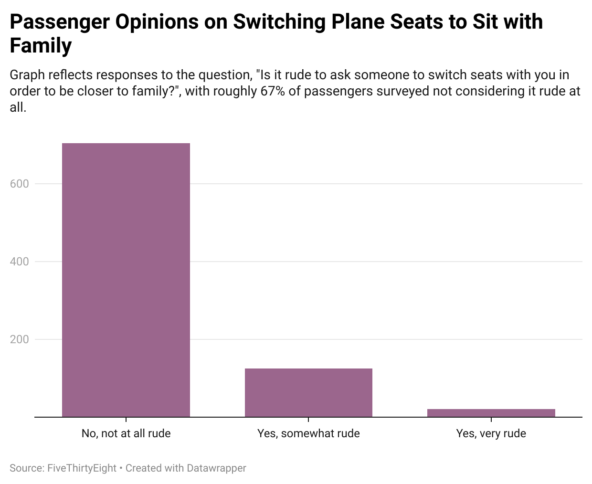

#  FiveThirtyEight Flying Etiquette Data: Is it rude to ask someone to switch seats with you in order to be closer to family?
## journ-124-week-4 

I chose this question above because I too have always wondered about this. I have been asked many times to switch seats for people traveling with a family and I have never found it rude, I always happily switch or kindly offer if I notice. However, I would feel rude if I were to ask someone else to move. This data is interesting because it shows that not many people find it rude to ask someone to switch seats on a plane. In fact, roughly 67% of people found it not rude at all. Only 125 of the 1040 people surveyed believed it to be somewhat rude and 20 people found it very rude. As a result, this chart reveals that you shouldn't be too worried about coming off as rude if you are in need of switching seats to be close to family. Likewise, if you do find this rude, you might need to prepare yourself to be asked this often, considering the large amount of people who find it socially acceptable to do so. 

Datawrapper chart using data from FiveThirtyEight's Flying Etiquette Survey data: 

